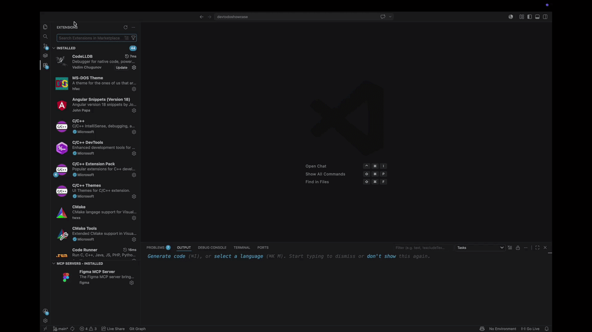

# DeV-Todo-Services



Сервис для генерации структурированной Trello-задачи из свободного TODO-текста. Перед генерацией сервис ищет похожие исторические задачи в ChromaDB/BM25, добавляет их в контекст модели и возвращает `name`, `desc`, `label`, `prio`, `time`, `roadmap`, `column` и `deadline`.

## Env

```env
ROUTER_API_KEY=...
TRELLO_API_KEY=...
TRELLO_TOKEN=...
TRELLO_BOARD_ID=...
```

`ROUTER_API_KEY` нужен для chat completions, embeddings и reranker. Trello-переменные нужны для `/app/v1/send`, чтобы получить актуальные колонки и labels доски.

## Локальный Запуск

```bash
uv sync
uv run uvicorn app.app:app --host 0.0.0.0 --port 8000 --reload
```

Проверка:

```bash
curl http://localhost:8000/app/v1/heartbeat
```

## API

### `GET /app/v1/heartbeat`

```json
{
  "status": "alive"
}
```

### `POST /app/v1/add_task`

Добавляет историческую задачу в ChromaDB и обновляет in-memory BM25 index.

```json
{
  "name": "Вынести webhook в отдельный клиент",
  "desc": "Сетевой вызов смешан с бизнес-логикой",
  "prio": "High",
  "label": "Bug",
  "created_at": "2024-05-06T10:00:00+03:00",
  "finished_at": "2024-05-06T12:00:00+03:00"
}
```

### `POST /app/v1/search`

Ищет похожие задачи через BM25 + Chroma vector search + RRF. Если reranker доступен, результаты дополнительно фильтруются по `reranker_score > 0.5`.

```json
{
  "query": "webhook клиент",
  "n_results": 10,
  "min_days": 0,
  "max_days": 365
}
```

### `POST /app/v1/send`

Генерирует Trello-задачу из текста. Endpoint сам ищет похожие исторические задачи и добавляет их в prompt.

```json
{
  "text": "TODO: вынести webhook в отдельный клиент"
}
```

## Docker

```bash
docker build -t todo-service .
docker volume create todo-chroma-db
docker run -d \
  --name todo-service \
  --env-file .env \
  -v todo-chroma-db:/app/db/chroma_db \
  -p 8000:8000 \
  todo-service
```

## Тесты

```bash
uv run pytest
```

## Требования

- Python `>=3.11,<3.14`
- OpenRouter API key
- Trello API key/token/board id
